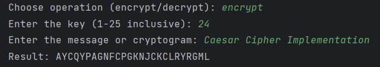
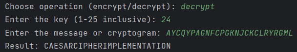
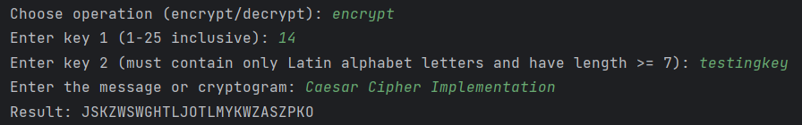
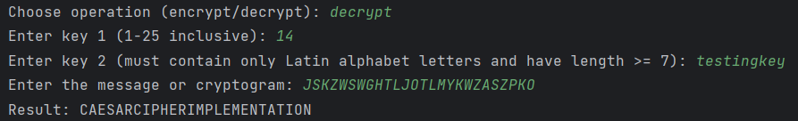

# Report: Caesar Cipher Implementation

## Subject: Caesar Cipher

### Task 1
#### Implementation of Caesar Algorithm for Single Key

The Caesar cipher is a simple encryption technique for the English alphabet. In this task, we implemented the Caesar algorithm using Python while adhering to specific constraints:

- We used only letter encodings, not relying on programming language-specific encodings like ASCII or Unicode.
- Key values were limited to the range of 1 to 25, and no other values were allowed.
- Text characters were restricted to 'A' to 'Z' and 'a' to 'z,' excluding any other characters.
- User input validation was implemented to ensure the correctness of the input.

We provided the following functionality:

- Transformation of the input text to uppercase and removal of spaces.
- Option for the user to choose between encryption and decryption.
- Input of the key and message or cryptogram.
- Display of the encrypted or decrypted result.

#### Code Implementation
```python
def caesar_cipher(text, key, operation):
    result = []

    for char in text:
        if 'A' <= char <= 'Z':
            base = ord('A')
        elif 'a' <= char <= 'z':
            base = ord('a')
        else:
            return "Invalid input. Only alphabetic characters are allowed."

        if operation == 'encrypt':
            new_char = chr((ord(char) - base + key) % 26 + base)
        elif operation == 'decrypt':
            new_char = chr((ord(char) - base - key) % 26 + base)
        else:
            return "Invalid operation. Choose 'encrypt' or 'decrypt'."

        result.append(new_char)

    return ''.join(result)
```

#### Example





### Task 2
#### Implementation of Caesar Algorithm with Two Keys

In this task, we extended the Caesar cipher algorithm to use two keys while preserving the conditions specified in Task 1. Additionally, key 2 was required to meet the following conditions:

- Key 2 should contain only letters of the Latin alphabet.
- Key 2 must have a length of at least 7 characters.

We provided the following functionality:

- Variation of key 2 for each character in the text.
- Implementation of user input validation for key 2.

#### Code Implementation
```python
def caesar_cipher(text, key1, key2, operation):
    result = []

    # Check if key2 contains only letters of the Latin alphabet and has length >= 7
    if not (key2.isalpha() and len(key2) >= 7):
        return "Invalid key 2. Key 2 must contain only Latin alphabet letters and have a length of at least 7."

    key2 = key2.upper()  # Convert key2 to uppercase

    for char in text:
        if 'A' <= char <= 'Z':
            base = ord('A')
        elif 'a' <= char <= 'z':
            base = ord('a')
        else:
            return "Invalid input. Only alphabetic characters are allowed."

        if operation == 'encrypt':
            shift = (ord(key2[len(result) % len(key2)]) - base) % 26  # Vary key2 for each character
            new_char = chr((ord(char) - base + key1 + shift) % 26 + base)
        elif operation == 'decrypt':
            shift = (ord(key2[len(result) % len(key2)]) - base) % 26  # Vary key2 for each character
            new_char = chr((ord(char) - base - key1 - shift) % 26 + base)
        else:
            return "Invalid operation. Choose 'encrypt' or 'decrypt'."

        result.append(new_char)

    return ''.join(result)
```
#### Example




### Conclusion

In conclusion, this report outlined the implementation of the Caesar cipher algorithm with both single and double keys in Python. The Caesar cipher is a straightforward encryption method for the English alphabet. While the version with two keys may not seem significantly more complex, it significantly reduces the likelihood of decryption through brute force. This dual-key approach increases the computational complexity required to crack the cipher, making it more secure compared to the single-key version.